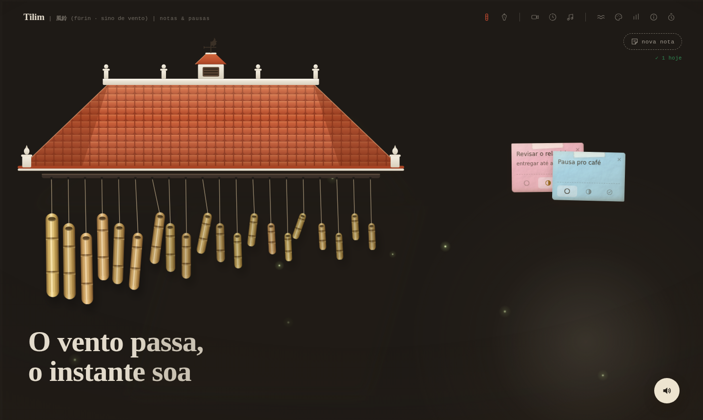

# Tilim 風鈴

**Uma companhia de pausa e foco.** Um carrilhão de vento interativo para
deixar aberto enquanto você trabalha, estuda ou precisa de uma pausa — organize o dia em post-its, e relaxe.



## Funcionalidades

- **Cortina-carrilhão com física real** — até 28 fios de contas de vidro ou
  varetas de bambu (Matter.js); o mouse é o vento, um toque dedilha uma nota,
  arrastar puxa a cortina e ela volta balançando
- **Som 100% procedural** — síntese modal via Web Audio API (sem samples):
  bambu seco e curto, vidro cristalino e ressonante, afinados em escala
  pentatônica; pan estéreo, reverb e variação de pitch por toque
- **Post-its de tarefas** — título, descrição, status (pendente / em
  andamento / concluído com contorno brilhante), cores, papel envelhecido;
  arrastáveis com o mouse e persistidos no navegador, com contador diário
  de tarefas concluídas
- **Rastreamento de mão** (opcional, MediaPipe) — a mão vira o vento;
  sobre um post-it: mão aberta pega, mão fechada solta, "tchau" apaga
- **Pomodoro integrado** — a virada de fase soa como uma melodia no próprio
  carrilhão (ascendente ao entrar na pausa, descendente ao voltar ao foco),
  com uma rajada de vento; o timer usa tempo real e segue correto em
  segundo plano
- **Ambiente vivo** — rajadas automáticas de vento, paisagens sonoras em
  loop (vento, chuva, floresta — também sintetizadas), ciclo dia/noite com
  folhas caindo ou vagalumes, tigela cantante no hover prolongado
- **Responsivo** — desktop, tablet e mobile (toque = vento e dedilhada;
  controles migram para uma barra inferior compacta)

_  *Inspirado em wind chimes de Marina Budarina.
_

## Stack

| | |
| --- | --- |
| React + Vite | interface e build |
| Matter.js | física headless (pêndulos, correntes, colisões) |
| Framer Motion | motion values → transform na GPU, sem re-render |
| Web Audio API | síntese de sons e paisagens, sem assets de áudio |
| MediaPipe tasks-vision | rastreamento de mão e gestos |

Todos os visuais (telhado de telhas, bambu, vidro, texturas de papel) são
SVG/CSS procedurais — o projeto não depende de nenhuma imagem externa.

## Rodando

```bash
npm install
npm run dev      # desenvolvimento
npm run build    # produção (dist/)
npm run preview  # serve o build
```

## Arquitetura & detalhes técnicos

### Separação de responsabilidades

O pipeline mantém três domínios desacoplados, comunicando-se por um único
estado de ponteiro e por *motion values*:

```
input (mouse/toque/mão) ──► pointerState ──► Matter.js (headless)
                                                   │ afterUpdate
                                                   ▼
                                        motion values (Framer Motion)
                                                   │
                                                   ▼
                                        transform GPU (sem re-render React)
```

- **Matter.js** é o cérebro físico e **nunca toca o DOM**: calcula posição,
  ângulo e colisões em um mundo *headless*.
- **Framer Motion** desenha: a cada frame o resultado da física é escrito em
  `motionValue()` imperativos, aplicados como `transform` — o React não
  re-renderiza durante a animação.
- **Web Audio API** sintetiza todo o som; nenhum arquivo de áudio é carregado.

### Física (Matter.js)

Solver configurado em `positionIterations: 10`, `velocityIterations: 8`,
`constraintIterations: 4` — precisão elevada para manter as correntes de
contas estáveis sem *jitter* nas junções.

**Parâmetros por material** (`config/materials.config.js`), calibrados para
que a assinatura tátil e sonora seja distinta:

| Parâmetro | Bambu | Vidro | Efeito |
| --- | --- | --- | --- |
| `restitution` | `0.42` | `0.62` | vidro ricocheteia mais → colisão "viva" |
| `frictionAir` | `0.011` | `0.005` | vidro oscila por mais tempo |
| `density` | `0.0035` | `0.0028` | massa relativa da peça |

A **cadeia de colisões** após um *pluck* é emergente, não script: o
`restitution` mais alto e o `frictionAir` baixo fazem a peça atingida
propagar o impacto às vizinhas em *knocks* decrescentes que convergem a zero
em poucos segundos, sem oscilação infinita.

**Restrições (constraints):**

| Uso | `stiffness` | `damping` |
| --- | --- | --- |
| Corda de suspensão (âncora → topo) | `0.95` | `0.03` |
| Elo entre contas da corrente | `0.95` | `0.04` |
| Mola de "puxar a cortina" (arrastar) | `0.055` | `0.06` |

A mola de arrasto propositalmente macia (`stiffness 0.055`) faz a cortina
seguir o cursor e **retornar balançando** ao soltar, em vez de saltar de
volta rigidamente.

**Correntes de vidro:** cada fio recebe um `collisionFilter.group` negativo
(`Body.nextGroup(true)`) — as contas de um mesmo fio não colidem entre si,
mas fios vizinhos tilintam ao se tocar. Contas de `9×13 px`, de 9 a 14 por
fio; até 28 fios simultâneos (~318 corpos rígidos ativos).

**Vento e brisa:** o vento ambiente é a soma de três senoides lentas
(`0.31 / 0.13 / 0.53 Hz`) modulada por rajadas cúbicas; a brisa do cursor
aplica força proporcional à velocidade do ponteiro, com `clamp` em ±40 e
raio de influência de `150 px`. Rajadas automáticas disparam a cada
`20–40 s`, apenas após `2 s` sem interação e com a aba visível.

### Áudio (Web Audio API, síntese modal)

Cada toque é sintetizado como uma **barra ressonante**: osciladores nas
razões modais do material somados a um transiente de ruído filtrado.

| | Bambu | Vidro |
| --- | --- | --- |
| Parciais (razões modais) | `1, 2.76, 5.4, 8.93` | `1, 2.32, 4.25, 6.63, 9.38` |
| `decay` (cauda) | `0.22 s` | `1.3 s` |
| Transiente | *toc* (`freq×2.2`, Q 1.4) | *tin* (`freq×9`, Q 3) |
| `reverbSend` | `0.18` | `0.42` |
| `detuneCents` | `0` | `4` (shimmer) |
| `pitchMul` | `1.0` | `2.4` |

Fundamental em `220 Hz`, afinação em **pentatônica de Lá menor** por
intervalos `[0, 3, 5, 7, 10]` semitons, estendida por oitavas — vizinhas
sempre consonantes. Variação de pitch de `±3%` por disparo (desligável no
**modo composição/kalimba**, que fixa a altura do *pluck*).

**Grafo de áudio:** vozes → `master` (0.85) e cama ambiente → `ambientOut`
(gain independente) convergem em um `DynamicsCompressor`
(`threshold -18 dB, knee 24, ratio 6:1`) antes do destino. Reverb por
convolução com resposta ao impulso procedural (`2.4 s`, decaimento `2.6`).
Polifonia limitada a `26` vozes; *throttle* anti-metralhadora de `90 ms`
(hover) / `45 ms` (demais) por peça.

**Cama ambiente** (vento/chuva/floresta) é sintetizada em tempo real —
ruído filtrado + LFOs + eventos estocásticos (pingos, pássaros) — com
crossfade de `~2 s` na troca. **Tigela cantante:** após `1.5 s` de hover a
voz de *sustain* sobe em rampa (teto `0.045`, inclinação `0.012/s`) e decai
com *release* de `2.4 s`, coexistindo por peça.

### Rastreamento de mão (MediaPipe)

`HandLandmarker` (`numHands: 1`, delegate GPU) rodando **inteiramente no
cliente** — o vídeo nunca sai do navegador. Ponta do indicador suavizada por
EMA (`α 0.35`); detecção de pose por contagem de dedos estendidos
(distância ponta–pulso vs. articulação); gesto de "tchau" por ≥3 inversões
de direção horizontal da palma em janela de `900 ms`.

### Renderização & performance

Partículas de atmosfera em Canvas 2D (`≤ 8` simultâneas, `devicePixelRatio`
limitado a `2`), pausadas com a aba oculta. `drop-shadow` aplicado só às
varetas de bambu (não às dezenas de contas de vidro); o vidro dispensa
`backdrop-filter` para escalar a centenas de corpos. Todo visual — telhado
de telhas, texturas de papel e madeira, brilho do vidro — é **SVG/CSS
procedural**; o repositório não versiona nenhuma imagem exceto o screenshot.
Bundle de produção: **~129 KB** (JS, gzip).

### Estado & persistência

Estado global leve via Context (`material`, tema dia/noite, densidade,
câmera, paisagem sonora, modo composição). Post-its e o contador diário de
concluídas são persistidos em `localStorage` — **nada é enviado à rede**.
O Pomodoro conta por `Date.now()` (não por `setInterval` ingênuo), então
permanece preciso mesmo com a aba em segundo plano; a virada de fase dispara
uma rajada forte (`strength 1.9`) e uma melodia pentatônica de 5 notas
(ascendente foco→pausa, descendente pausa→foco).

## Privacidade & segurança

- **Processamento local.** Câmera e rastreamento de mão rodam via WebAssembly
  no navegador; nenhum frame de vídeo é transmitido ou armazenado.
- **Sem telemetria.** O código não faz requisições de rede para envio de
  dados — não há `fetch`/`XHR`/`sendBeacon` de dados do usuário.
- **Dados só no dispositivo.** Notas e preferências ficam em `localStorage`.
- **Dependências externas em runtime** limitam-se a fontes (Google Fonts) e
  ao modelo do MediaPipe (CDN oficial), este último carregado apenas quando
  a câmera é ativada.
- Nenhum segredo, token ou credencial no repositório.

## Estrutura

```
src/
├── components/   # cena, telhado, cortina, post-its, painel, partículas
├── physics/      # mundo Matter + ponte física → motion values
├── input/        # mouse, toque, mão (gestos) — fonte única de ponteiro
├── audio/        # AudioEngine: sínteses, paisagens, sustain
├── hooks/        # pomodoro
├── config/       # escala/peças e materiais (visual + física + som)
└── state/        # estado global (material, tema, densidade, câmera…)
```
